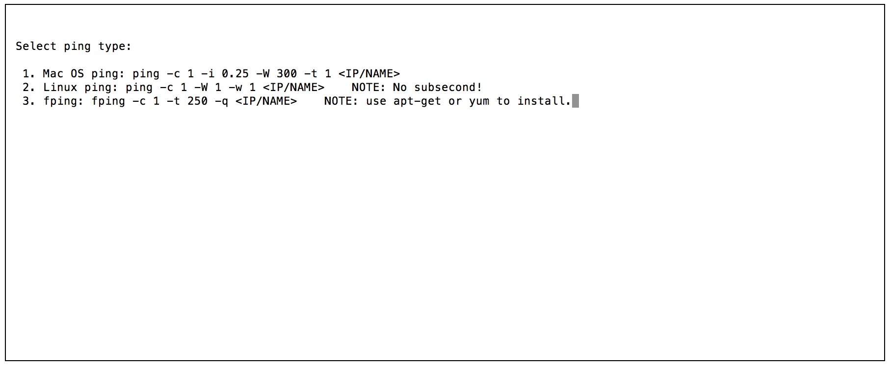
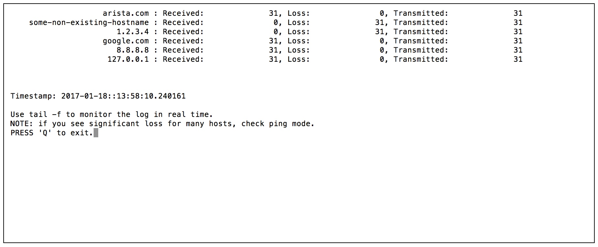

# PyPing_tool

This is a modified version of multithreaded ping that can be used to monitor monitor ping stats for multiple hosts during some testing.

To start pinging:  


* Create a file with ip addresses/host names to ping. For example

```
cat ./ip_to_ping.txt 
8.8.8.8
127.0.0.1
1.2.3.4
arista.com
google.com
```

* Start the tool.
```
./PyPing_tool.py -f ip_to_ping.txt
```

* Select a ping command to use.


* Tool will create a log file with ping stats in the working directory.

* Stats will be displayed in real time.

